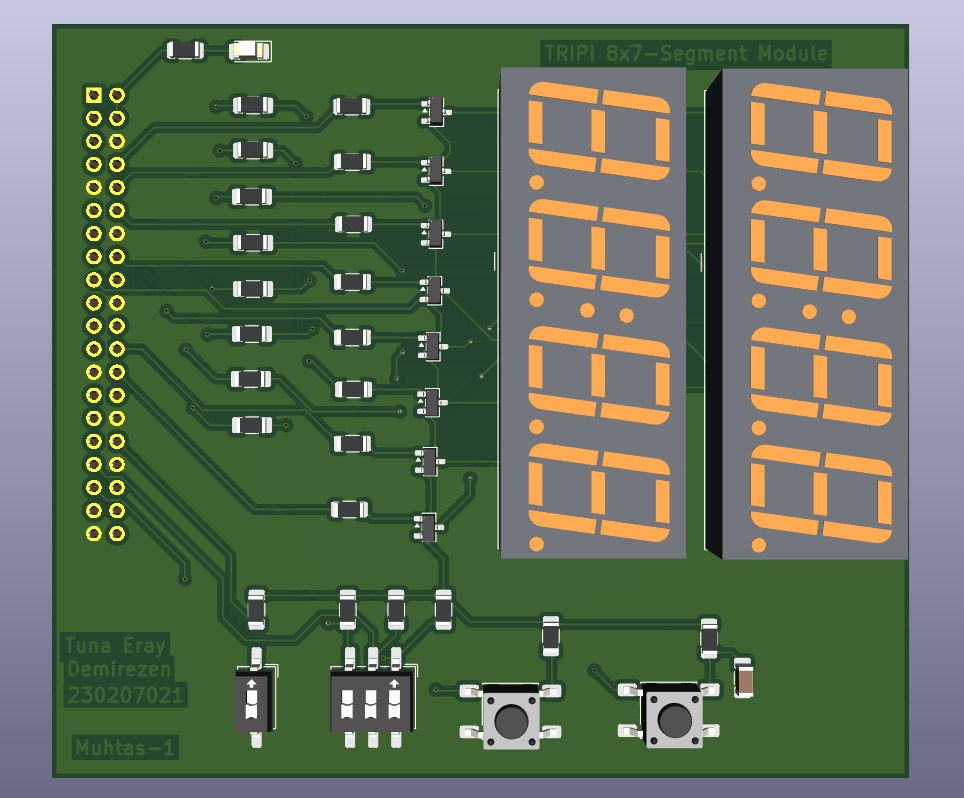
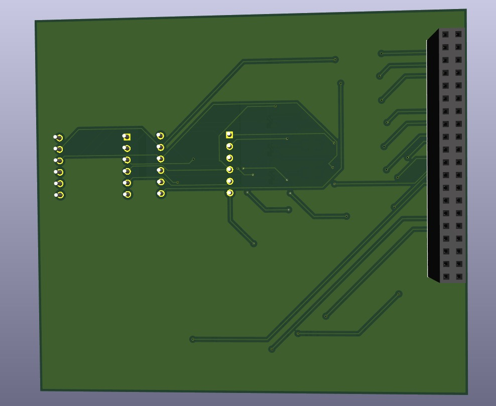

# TRIPI 7-Segment Display Module

A peripheral expansion board designed for the TRIPI (Trion-based FPGA) platform, featuring 8 seven-segment displays, external push buttons, switches, and a reset mechanism.

## Overview

This project provides a ready-to-use hardware module for FPGA-based digital logic and display control applications. The board connects directly to the 40-pin GPIO header of the TRIPI FPGA board, enabling students and developers to implement and test digital systems without additional wiring or breadboarding.

## Features

- 8x seven-segment displays for multi-digit numeric output
- External push buttons and switches for user input
- Reset functionality for system control
- 2-layer PCB designed for the TRIPI FPGA 40-pin GPIO header
- Plug-and-play integration with the Trion-based FPGA platform

## Use Case

Designed as an educational hardware platform, this module allows students to:

- Implement digital logic circuits on a real FPGA
- Develop display control and multiplexing applications
- Prototype FPGA-based digital systems
- Learn hardware-software co-design in an embedded context

## Hardware

- **Platform:** TRIPI (Trion-based FPGA)
- **Interface:** 40-pin GPIO header
- **PCB:** 2-layer board
- **Display:** 8x seven-segment displays
- **Input:** Push buttons, DIP switches, reset button

## Images

### PCB Front

### PCB Back

.
